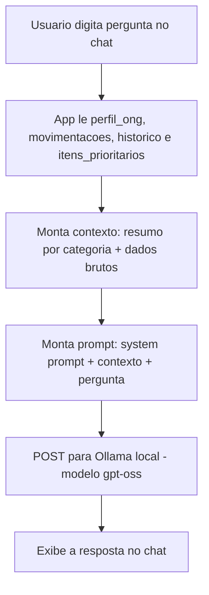

# Amparo — Agente Educativo Financeiro para ONGs

Agente conversacional que ajuda gestores de ONGs a entender receitas, despesas e prioridades de gasto, usando um LLM local (Ollama) sobre dados financeiros da própria instituição. Desenvolvido como Trabalho de Conclusão de Curso.

**Status:** protótipo acadêmico funcional — responde perguntas com base em dados fictícios de uma ONG de exemplo; sem memória de conversa, sem testes automatizados, sem `requirements.txt`.

---

## Problema Resolvido

ONGs pequenas, principalmente as tocadas por gente sem formação financeira, costumam ter dificuldade pra enxergar com clareza pra onde o dinheiro está indo e o que priorizar quando o orçamento é apertado. Não falta boa vontade, falta uma forma simples de organizar e explicar os números.

O Amparo lê os dados financeiros da ONG e conversa sobre eles em linguagem simples: explica categorias de gasto, ajuda a comparar cenários de prioridade e admite quando não tem dado suficiente pra responder. Ele nunca decide por ninguém — só organiza e explica.

---

## Como Funciona



Cada pergunta é tratada de forma isolada: o app recarrega os dados, remonta o contexto inteiro e manda pro Ollama junto com a pergunta atual — sem nenhum turno anterior da conversa.

---

## Arquitetura

Todo o sistema vive em um único arquivo, **`src/app.py`**: carregamento dos dados, montagem do contexto, chamada ao Ollama e interface Streamlit estão juntos, sem separação entre "frontend" e "backend". Não existe um `engine.py` nem qualquer outro módulo — é intencionalmente simples pra um projeto deste escopo.

- **Carregamento de dados**: lê os quatro arquivos de `data/` (um JSON de perfil, dois CSVs, um JSON de itens prioritários) a cada execução.
- **Montagem de contexto**: agrega as movimentações por categoria e também inclui os dados brutos (CSVs inteiros) no prompt.
- **Chamada ao modelo**: uma função (`perguntar`) monta o prompt completo e faz um `requests.post` cru pro endpoint local do Ollama.
- **Interface**: componentes de chat do Streamlit (`st.chat_input`, `st.chat_message`).

O "Motor de Regras" descrito no desenho de arquitetura em `docs/01-documentacao-agente.md` não existe como componente de código separado — os critérios de priorização (urgência, impacto, recorrência, orçamento) são só uma seção de instruções dentro do texto do system prompt, aplicados pelo próprio modelo ao responder, não por lógica determinística em Python.

---

## Decisões de Arquitetura

**Ollama local (`gpt-oss`), não uma API de nuvem** — é a decisão mais importante do projeto: como o agente lida com dado financeiro (mesmo sendo fictício nesta versão), rodar o modelo localmente garante que nada saia da máquina e evita depender de uma chave de API paga.

**Streamlit** — pela velocidade de montar uma interface de chat sem escrever HTML/JS, adequado ao escopo de um TCC com uma única tela.

**Tudo em um arquivo só** — pro tamanho atual do projeto (uma tela, um fluxo), preferi manter tudo em `app.py` a criar uma estrutura de módulos que não teria uso real ainda.

**Prompt extenso, com regras explícitas de "nunca faça X"** — como o agente toca em decisões financeiras de uma ONG, priorizei deixar as restrições (não decidir, não inventar dado, não aprovar pagamento) bem explícitas no texto do prompt, em vez de confiar no bom senso do modelo.

**Contexto com dados brutos, não só o resumo** — enviar as movimentações e o histórico inteiros (`.to_string()`) garante que o modelo tenha qualquer detalhe específico disponível, ao custo de mais tokens por chamada. `docs/02-base-conhecimento.md` já registra uma versão resumida como ideal futuro; o código hoje ainda manda tudo.

---

## Trade-offs

**Sem memória de conversa — nem no modelo, nem na tela.** A função `perguntar()` monta um prompt novo a cada chamada, só com a pergunta atual; o modelo não sabe o que foi perguntado antes. E como a interface não usa `st.session_state`, o Streamlit reexecuta o script do zero a cada pergunta nova, e só a troca mais recente fica visível — a pergunta e resposta anteriores somem da tela. Pra uma pergunta pontual isso passa despercebido; pra um acompanhamento contínuo ("e sobre o que eu te perguntei antes?"), não funciona.

**Dados brutos x resumidos no contexto.** Mais detalhe disponível pro modelo, mas o prompt (e o tempo de resposta do Ollama rodando localmente) cresce junto com a base de dados — não escalaria bem com um histórico de vários meses de movimentação.

**Zero-nuvem x fricção de instalação.** Rodar 100% local garante privacidade, mas exige que quem for usar o projeto instale o Ollama, baixe o modelo `gpt-oss` e mantenha `ollama serve` rodando antes de abrir o Streamlit — não é "clique e use".

**Regras de negócio só no prompt, não em código.** Mais simples de escrever e ajustar, mas é uma garantia de comportamento do modelo, não uma validação estrutural — nada no código impede uma resposta que fuja das regras, se o modelo eventualmente não seguir o prompt à risca.

---

## Estrutura do Projeto

```text
amparo-agent/
├── src/
│   └── app.py                       # dados + contexto + chamada ao Ollama + interface Streamlit, tudo junto
├── data/
│   ├── perfil_ong.json               # dados fixos da ONG de exemplo
│   ├── movimentacoes_ong.csv         # entradas e saídas simuladas
│   ├── historico_analises.csv        # histórico fictício de análises anteriores
│   └── itens_prioritarios.json       # lista de itens e nível de prioridade
├── docs/
│   ├── 01-documentacao-agente.md     # persona, escopo e caso de uso
│   ├── 02-base-conhecimento.md       # estrutura dos dados simulados
│   ├── 03-prompts.md                 # evolução do system prompt
│   └── 04-metricas.md                # plano de avaliação (resultados ainda não preenchidos)
└── assets/                            # prints do Amparo rodando
```

---

## Tecnologias

| Tecnologia | Papel no projeto |
|---|---|
| Streamlit | Interface de chat |
| Pandas | Leitura e agregação dos CSVs de movimentação e histórico |
| Requests | Chamada HTTP crua ao endpoint local do Ollama |
| Ollama (`gpt-oss`) | Modelo de linguagem, rodando localmente |

Não há `requirements.txt` neste repositório — as dependências estão documentadas só como comando de instalação.

---

## Como Executar

### 1. Instalar e subir o Ollama

```bash
# baixar em ollama.com
ollama pull gpt-oss
ollama serve
```

### 2. Instalar as dependências Python

```bash
pip install streamlit pandas requests
```

### 3. Rodar o Amparo

```bash
streamlit run src/app.py
```

O Streamlit abre automaticamente no navegador (geralmente `http://localhost:8501`).

---

## Como Testar

Não há testes automatizados. A validação prevista é o roteiro de perguntas em `docs/04-metricas.md`: identificar a maior categoria de gasto, priorizar sem decidir pela ONG, reconhecer pergunta fora de escopo e admitir dado inexistente no contexto.

Vale registrar: a seção "Resultados" desse documento ainda está com `[Preencher após os testes]` — os testes com pessoas reais foram planejados, mas os resultados não chegaram a ser registrados no repositório.

---

## Limitações Conhecidas

- Sem memória de conversa: nem o modelo recebe o histórico da conversa, nem a interface mantém as trocas anteriores visíveis na tela (sem `st.session_state`).
- Não há `requirements.txt`; as dependências só aparecem como comando no README.
- Dados 100% fictícios e estáticos — não há upload de planilha real nem atualização dos arquivos pela aplicação em uso.
- Contexto envia os CSVs inteiros a cada pergunta, o que cresce o tempo de resposta e o consumo de tokens conforme a base aumenta.
- O "Motor de Regras" citado na documentação do projeto não existe como código — é só a seção de critérios de priorização dentro do texto do system prompt.
- O plano de avaliação (`docs/04-metricas.md`) tem os testes definidos, mas a seção de resultados está em branco.
- Depende do Ollama rodando localmente com o modelo `gpt-oss` já baixado; sem isso, toda pergunta retorna erro de conexão.

---

## O que este projeto ainda NÃO faz

- Não mantém histórico de conversa, nem pro usuário reler nem pro modelo usar como contexto.
- Não lê dados de uma fonte real da ONG — só os quatro arquivos de exemplo em `data/`.
- Não tem testes automatizados nem CI/CD.
- Não tem autenticação — qualquer pessoa com acesso à máquina onde o Streamlit roda vê os dados financeiros exibidos.
- Não resume o contexto antes de enviar pro modelo — envia os dados brutos inteiros.

---

## Próximos Passos

- Adicionar `st.session_state` para manter o histórico da conversa visível e reenviá-lo ao modelo, dando memória real ao Amparo.
- Resumir o contexto (como já esboçado em `docs/02-base-conhecimento.md`) em vez de enviar os CSVs inteiros.
- Criar um `requirements.txt` de verdade, fixando as versões usadas.
- Substituir os arquivos de exemplo por upload de planilha própria da ONG, com alguma validação de formato.
- Rodar os testes do plano de avaliação com pessoas reais e registrar os resultados em `docs/04-metricas.md`.

---

## Evolução para Produção

- **Persistência de conversa** por sessão/usuário, em vez de perder tudo a cada rerun do Streamlit.
- **Múltiplos perfis de ONG**, no lugar de um único `perfil_ong.json` fixo.
- **Autenticação simples**, já que os dados envolvidos são financeiros.
- **Resumo/paginação do contexto** enviado ao modelo, conforme o histórico de movimentações cresce.
- **Testes automatizados** cobrindo ao menos a parte determinística do sistema: carregamento de dados e montagem do contexto.

---

## Aprendizados

A maior lição veio só nesta revisão: percebi que a interface não guarda o histórico da conversa — cada pergunta nova apaga a troca anterior da tela, porque nunca cheguei a usar `st.session_state`. Passa despercebido numa demonstração rápida, mas fica evidente em qualquer uso contínuo.

Reler a documentação do projeto ao lado do código me mostrou que o "Motor de Regras" que desenhei no diagrama de arquitetura, na prática, virou só texto dentro do system prompt — não um componente separado. É uma diferença real entre o que foi desenhado e o que foi de fato implementado.

Escrever regras explícitas de "nunca faça X" no prompt (não decidir, não inventar dado, não aprovar pagamento) funcionou melhor do que eu esperava pra manter o agente no papel, mas continua sendo uma garantia de comportamento do modelo, não uma trava de código.

Rodar o modelo localmente via Ollama me fez pensar em latência de um jeito que uma API de nuvem esconde: cada resposta depende inteiramente da máquina que está rodando o `gpt-oss`.

---

## Autor

**Robert Emanuel**

Desenvolvedor Back-end focado em Python, FastAPI, SQL, Docker e APIs REST.

GitHub:
https://github.com/r0b3rTdk

LinkedIn:
https://www.linkedin.com/in/robert-emanuel/
