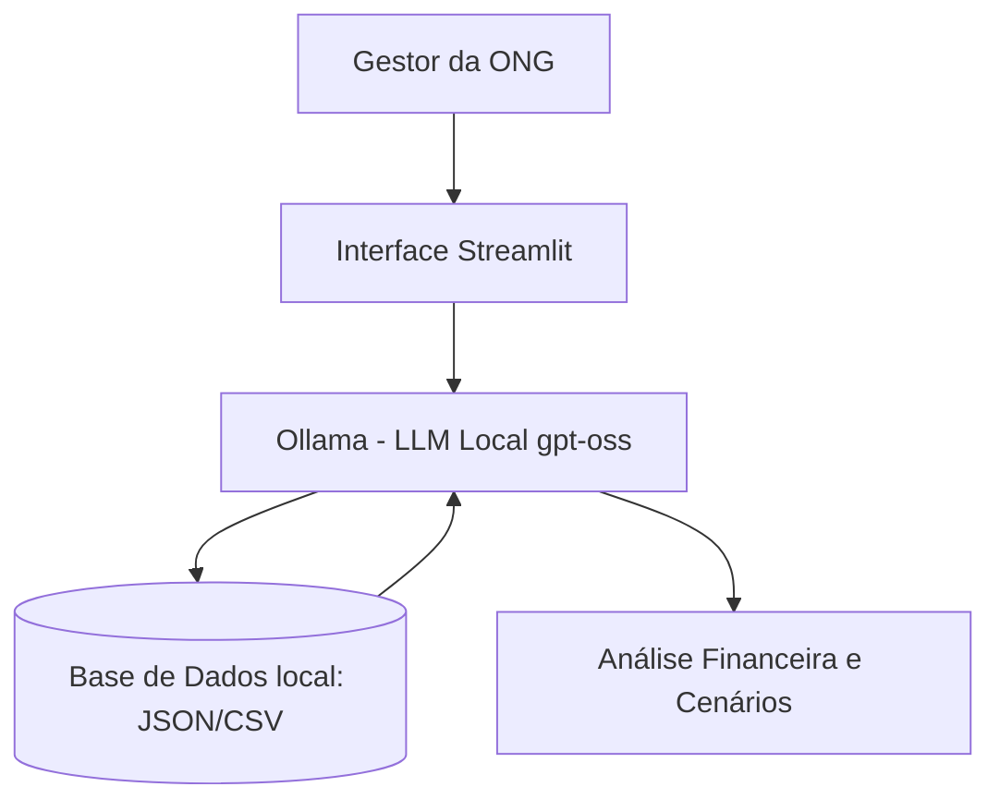

# 💙 Amparo - Agente Educativo Financeiro para ONGs

> Agente de IA Generativa que apoia gestores de ONGs (com foco em crianças atípicas) na organização financeira, traduzindo dados contábeis em análises didáticas e cenários claros para facilitar a tomada de decisão.

## 💡 O Que é o Amparo?

O Amparo é um educador e assistente financeiro que **analisa e organiza**, mas nunca decide. Ele explica para onde os recursos estão indo e ajuda a refletir sobre prioridades de gastos, usando a realidade da própria ONG como base.

**O que o Amparo faz:**
- ✅ Explica a distribuição de receitas e despesas de forma simples.
- ✅ Usa o orçamento atual da ONG para criar cenários práticos.
- ✅ Ajuda a mapear prioridades com base em urgência e impacto social.
- ✅ Admite quando não tem dados suficientes (anti-alucinação).

**O que o Amparo NÃO faz:**
- ❌ Não toma decisões de compras ou pagamentos.
- ❌ Não aprova remanejamento de verbas.
- ❌ Não substitui o papel do gestor, diretor ou contador.
- ❌ Não inventa dados financeiros fora do contexto fornecido.

## 🏗️ Arquitetura



**Stack:**
- Interface: Streamlit
- LLM: Ollama (modelo local `gpt-oss`)
- Dados: JSON e CSV locais (Zero envio para nuvem)

## 📁 Estrutura do Projeto

```text
├── assets/                        # Prints do Amparo rodando
│   ├── Amparo - [1].png   
│   ├── Amparo - [2].png  
│   └── Amparo - [3].png 
│
├── data/                          # Base de conhecimento e contexto
│   ├── orcamento_atual.csv        # Histórico de receitas e despesas
│   └── perfil_ong.json            # Saldo atual, metas, critérios de prioridade
│
├── docs/                          # Documentação do TCC
│   ├── 01-documentacao-agente.md  # Persona, escopo e caso de uso
│   ├── 02-base-conhecimento.md    # Estrutura dos dados simulados
│   └── 03-prompts.md              # Evolução do System Prompt
│
└── src/
    ├── app.py                     # Aplicação Streamlit (Frontend)
    └── engine.py                  # Integração com Ollama (Backend)
```

## 🚀 Como Executar

### 1. Instalar Ollama
```bash
# Baixar em: ollama.com
ollama pull gpt-oss
ollama serve
```

### 2. Instalar Dependências
```bash
pip install streamlit pandas requests
```

### 3. Rodar o Amparo
```bash
streamlit run src/app.py
```

## 🎯 Exemplos de Uso

**Pergunta:** "Para onde está indo a maior parte do nosso dinheiro este mês?"  
**Amparo:** "Analisando nossos registros, a maior parte dos recursos (45%) está sendo direcionada para os pagamentos dos terapeutas ocupacionais e fonoaudiólogos (R$ 8.500). Em seguida, temos a manutenção do espaço físico (R$ 3.200). Quer que eu detalhe os gastos menores para vermos onde é possível otimizar?"

**Pergunta:** "Vale mais a pena comprar computadores para a secretaria ou novos materiais lúdicos?"  
**Amparo:** "Essa é uma escolha importante. Se investirmos nos computadores (R$ 4.000), consumiremos 40% do saldo atual. Já os materiais lúdicos (R$ 1.500) têm um impacto mais imediato nas terapias diárias das crianças e consomem menos caixa. Considerando que nosso saldo é de R$ 10.000, qual dessas frentes precisa de suporte mais urgente hoje?"

## 📊 Métricas de Avaliação

| Métrica | Objetivo |
|---------|----------|
| **Neutralidade (Zero Decisão)** | O agente apresenta cenários em vez de dar ordens diretas? |
| **Anti-Alucinação** | O agente recusa-se a inventar saldos ou gastos inexistentes? |
| **Didática e Empatia** | A linguagem é acessível para não-contadores e acolhedora? |
| **Aderência ao Escopo** | O agente nega responder perguntas fora do contexto da ONG? |

## 🎬 Diferenciais

- **Privacidade Total (Local-First):** Finanças de ONGs são sensíveis. O uso do Ollama garante que os dados nunca saiam do computador local.
- **Foco em Impacto Social:** Prompt desenhado especificamente para as prioridades de uma ONG que lida com crianças atípicas.
- **Transparência:** O modelo é forçado a admitir limitações caso os dados não estejam presentes nos arquivos CSV/JSON.

---
**Desenvolvido como Trabalho Prático de Conclusão de Curso.**